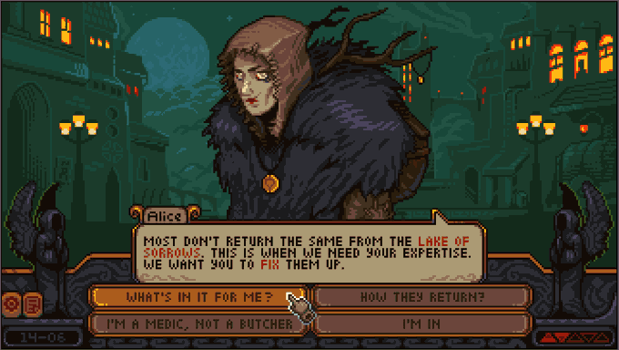

# Le serment de la Lune
  
**Option choisie :** Trace ton chemin (B)
  
**Membre de l'équipe et les rôles de chacun :**
  
**Ryan Dufault :** Chef de projet /Architecture
  
**Yannick Chamberland :** Données + système + animations
  
**Benjamin Ferland :** Narration + design
  
**Brainstorm :**
  
histoire médiévale classique chevalier avec princesse avec twist super originale + art abstrait "expérimental?"
pour se dissocier de l'idée stéréotypée qu'on a quand on pense à un visuel sur le thème du "médiévale" "moyen age" 

Nouveau brainstorm (follow up) : 
chevalier + sorcière + malédiction
blanche neige reconstruit original
une histoire "disney" à l'ancienne princesse wow ou autre reconstruite
s'inspirer d'une intrigue/histoire similaire à Le Cid
 
prince doit choisir entre devoir envers royaume et amour pour une femme maudite qui ne peut vivre qu’à la lumière de la lune (à déterminer?). chaque nuit qu’il passe avec elle accélère la chute de son empire. prophétie dit que seule “rupture du serment” apporte paix mais on ne sait pas si elle parle d’un sacrifice ou d’une trahison. 
 
Ajout d'une idée pour l'histoire :
serment avec des dieux pour que la lune soie enchainée pour que le soleil reigne? 
la lune pourrait être devenue humaine; la fille que le prince aime
chaque moment avec le prince accélère chute royaume à cause du serment

idées nom perso princi :
william
jean
dylan
agnès

exemples d'images du brainstorm (filtre pixelisé) :

.png)

[Fichier Figma](https://www.figma.com/design/ikszxBVEsDPQzowvWjxWxo/projet-integrateur-web-5?node-id=0-1&t=JprmHNREdA3jTDza-1)
  
[Fichier Trello](https://trello.com/invite/b/68e66eab99c6fadf2dfd0b0e/ATTI2f1b6b4e236c2f769e7b616f4fb3d2f352D6216C/projet-integrateur-web-5)

