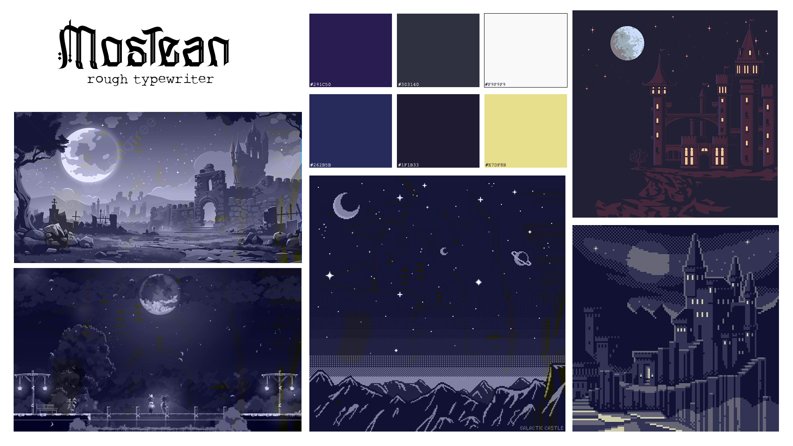
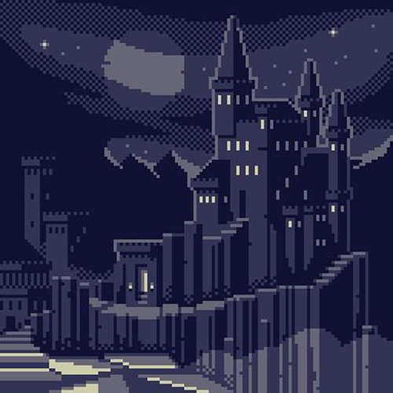
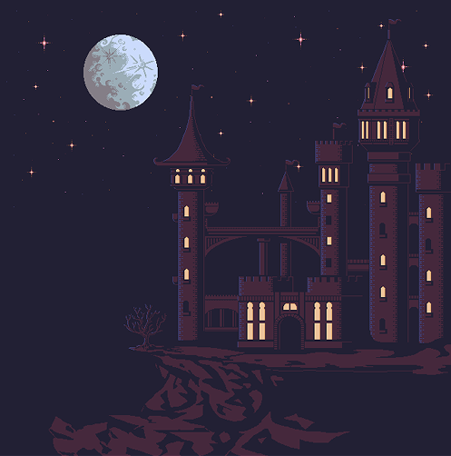
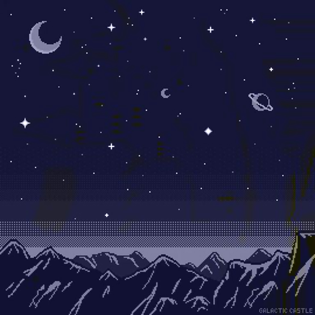
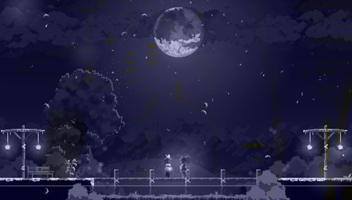

# Cahier de Charges: Trace ton chemin

## 📌 Informations du Projet

*Nom du projet:* Le serment de la Lune
*Nom de l'équipe:* Les 3 Mousquetaires
*Membres:*

- [Ryan Dufault] - Chef de projet / [Architecture]
- [Yannick Chamberland] - [Données + système + animations]
- [Benjamin Ferland] - [Narration + design]

*Date de début:* [10/11/2025]  
*Date de livraison finale:* [10/12/2025]  
*Version du document:* 1.0


## 🎯 1. Présentation du Projet

### 1.1 Concept général
Décrivez en 2-3 paragraphes le concept de votre histoire interactive:

Le Serment de la Lune est une histoire interactive où le joueur incarne Agnès, un prince déchiré entre son devoir envers le royaume et son amour pour Aurore, une femme mystérieuse liée à une ancienne malédiction. Autrefois, les rois ont juré aux dieux de enchaîner la Lune pour que le Soleil règne à jamais. Mais cette promesse a transformé la Lune en humaine, condamnée à vivre cachée.

En rencontrant Aurore, Agnès découvre la vérité : chaque instant passé avec elle affaiblit le Soleil et menace l’équilibre du royaume. Le joueur devra faire des choix difficiles entre amour et responsabilité, menant à plusieurs fins possibles selon les décisions prises.


### 1.2 Public cible

- *Âge:* [13-35 ans]
- *Profil:* [Amateurs de récits intéractifs, de contes fantastiques, d'histoires tragico-romantiques et de dilemmes moraux.]
- *Niveau technique:* [Utilisateurs grand public]
- *Temps de lecture estimé:* [ex: 20-45 minutes pour une partie complète --- À voir selon architecture narrative]

### 1.3 Objectifs du projet

- [ ] Créer une expérience narrative immersive et émotionnelle
- [ ] Développer un système de choix avec conséquences réelles
- [ ] Implémenter un système de sauvegarde de progression
- [ ] Démontrer la maîtrise de Vue.js, GSAP et Pinia
- [ ] Créer une interface accessible et responsive
- [ ] [Autre objectif spécifique]


## 📖 2. Architecture Narrative

### 2.1 Synopsis détaillé

Agnès, prince héritier d’un royaume éternellement ensoleillé, découvre Aurore, une femme maudite : elle n’existe pleinement que sous la lumière de la lune. Autrefois, les rois ont juré aux dieux d’enchaîner la Lune pour assurer un soleil sans fin. Ce serment a transformé la Lune en humaine et assuré la prospérité du royaume, au prix d’un cycle naturel brisé. En la rencontrant, Agnès tombe amoureux, et chaque moments passé avec elle affaiblit le Soleil et menace la survie du royaume.

Le joueur guide Agnès à travers 8–10 scènes où ses choix moraux et émotionnels pèsent sur l’équilibre du monde. Certains choix protègent le peuple au détriment de l’amour, d’autres sauvent Aurore mais accélèrent la chute du régime solaire. L’histoire mise sur dilemmes clairs, tension tragique et conséquences visibles, menant à plusieurs fins distinctes (sacrifice, libération, tyrannie, compromis).

[Écrivez votre synopsis ici]

### 2.2 Arbre narratif

Dessinez ou décrivez l'arbre de décisions de votre histoire:

*Structure globale:*

- *Acte 1* — Intro (chap. 1–2) : Mise en place du royaume, du serment, rencontre avec Aurore. Linéaire pour ancrer le contexte.

- *Acte 2* — Développement (chap. 3–7) : Apparition de choix récurrents (2–3 options max), conséquences cumulatives visibles (mètre de Soleil / Loyauté / Secret). Branches convergent parfois mais conservent impacts.

- *Acte 3* — Climax & résolution (chap. 8–10) : Choix finaux déterminant une des 3–5 fins. Dénouements émotionnels et symboliques.

### 2.3 Liste des chapitres/scènes

Minimum 8 niveaux (chapitres/scènes). Listez-les avec leurs informations:

<small>(les noms des chapitres énoncés ici ne sont que des exemples)</small>

| #  | Nom du chapitre              | Type           | Description courte                                                                | Choix proposés (2–3)                                                                                                      | Conséquences principales                                                 |
| -- | ---------------------------- | -------------- | --------------------------------------------------------------------------------- | ------------------------------------------------------------------------------------------------------------------------- | ------------------------------------------------------------------------ |
| 1  | L’aube parfaite              | Linéaire       | Introduction du royaume de Solaria et du serment solaire.                         | Aucun                                                                                                                     | Contexte + déclencheurs (set flags)                                      |
| 2  | La tour oubliée              | Linéaire       | Agnès découvre Aurore cachée dans une ancienne tour.                              | Aucun (rencontre)                                                                                                         | Établit lien affectif, révélation sur la malédiction           |
| 3  | Le premier secret            | Choix          | Un chasseur surprend Agnès et Aurore ensemble dans la tour.                             | 1. Le supplier de garder le secret / 2. Le convaincre avec une récompense / 3. L’effrayer pour le faire taire                                                                                    | Affecte Loyauté (peuple/cour) et Secret (connaissance)                   |
| 4  | Nuit volée                   | Choix          | Agnès passe sa première nuit entière avec Aurore.                                 | 1. Rester toute la nuit / 2. Partir au lever / 3. Chercher un compromis (risque minime)                                   | Diminue la jauge Soleil, augmente Affection, baisse confiance du conseil |
| 5  | Le Conseil du Roi            | Choix          | Le père convoque Agnès ; rumeurs sur l’affaiblissement du Soleil.                 | 1. Mentir / 2. Avouer (en partie) / 3. Détourner la faute                                                                 | Affects : Loyauté du peuple, sanction possible, déclenche enquêtes       |
| 6  | Les blessures du sol         | Choix          | Apparition de conséquences : récoltes moins abondantes, émeutes. Agnès doit agir. | 1. Aider le peuple (priorité) / 2. Protéger Aurore (secret) / 3. Trouver un remède (quête)                                | Impact direct sur survie/populaire; change options futures               |
| 7  | Le jour de l’éclipse         | Choix majeur   | Le royaume subit une crise : le Soleil faiblit fortement.                         | 1. Sacrifier l’amour (séparer) / 2. Libérer la Lune (rupture complète) / 3. Prendre le trône et forcer un nouveau serment | Majeur pour détermination de la fin                                      |
| 8  | La nuit promise              | Linéaire/Choix | Dénouement immédiat selon choix 8 : scènes émotionnelles finales.                 | 1–2 options mineures pour nuance                                                                                          | Détermine épilogue émotionnel                                            |
| 9 | Épilogue                     | Linéaire       | Montage final : état du royaume et conséquences pour Agnès et Aurore.             | Aucun                                                                                                                     | Fin choisie s’affiche                                                    |


### 2.4 Fins possibles

Listez toutes les fins de votre histoire (minimum 3, idéal 4-6):

| # | Nom de la fin                  | Condition pour l'atteindre                                                                                           | Type                                                                        |
| - | ------------------------------ | -------------------------------------------------------------------------------------------------------------------- | --------------------------------------------------------------------------- |
| 1 | **Sacrifice solaire**          | Priorité au royaume : plusieurs choix en faveur du peuple, séparation d’avec Aurore, rituel pour restaurer le Soleil | Tragique / «bonne» pour le royaume                                          |
| 2 | **La Lune libérée**            | Accumulation de choix pro-Aurore, brisure du serment, Soleil s’effondre mais cycle naturel revient, royaume en cendres à cause du serment                   | Romantique / ambiguë (bon pour l’équilibre naturel, mauvais matériellement) |
| 3 | **Le Roi de cendres**          | Agnès choisit le pouvoir, impose un nouveau serment, emprisonne Aurore ; règne dur pour maintenir la lumière        | Mauvaise / tyrannique                                                       |

### 2.5 Personnages principaux

| Nom         | Rôle                                      | Description                                               | Apparaît dans           |
| ----------- | ----------------------------------------- | --------------------------------------------------------- | ----------------------- |
| Agnès       | Protagoniste                              | Prince réputé, déchiré entre devoir et amour.          | Tous                    |
| Aurore      | Intérêt amoureux / incarnation de la Lune | Femme-mystère, fragile au jour.                          | Tous (surtout chap.2–8) |
| Roi         | Père / antagoniste moral                  | Roi fidèle au serment, veut garder la prospérité.         | 1,5,8                   |
| Le Chasseur | Témoin accidentel                        | Villageois ayant surpris Agnès et Aurore, moteur des rumeurs. | 3                  |
| Le Peuple   | Ensemble                                  | Réactions, émeutes, fidélité variable                     | 5-9      |


### 2.6 Système de conséquences

**Métriques (internes / visibles) :**  

- **Jauge Soleil (0–100)** : représente la force du soleil / prospérité du royaume. Diminue à chaque moment prolongé avec Aurore (chap.4) ou lors de choix risqués pour la libérer (chap.7).  
- **Loyauté / Soutien (0–100)** : confiance envers Agnès. Baisse si Agnès cache la vérité ou favorise Aurore (chap.3, 5, 6) ; augmente s’il agit pour le bien du peuple.  
- **Secret / Connaissance (flags)** : marque si la cour ou un témoin (le Chasseur) connaît la vérité sur Aurore et le serment (chap.3). Débloque certaines options dans les chapitres suivants.  

**Influence sur le récit :**

- **Effet immédiat** : certains choix provoquent des changements visibles directement (ex : -15 Soleil, +10 Affection pour Aurore). Ces effets se traduisent par des scènes différentes (pénuries, émeutes, réactions du roi ou du peuple).  
- **Effet cumulatif** : les métriques s’additionnent pour déterminer la disponibilité de certaines actions (ex : certaines options du chapitre 6 ne sont possibles que si Loyauté > 30) et conditionnent les fins (ex : fin « Sacrifice solaire » possible si Loyauté élevée et Soleil < 40).  
- **Flags narratifs** : révélations sur Aurore (Secret=true) ouvrent des dialogues supplémentaires et influencent le chapitre 7 et l’épilogue.  

**Feedback pour le joueur :**  
- Affichage discret de la jauge Soleil et de l’indicateur de Loyauté pour montrer les conséquences sans spoiler les résultats finaux.  
- Les actions dans les chapitres 3–6 sont perceptibles dans le monde (p. ex. émeutes si Soleil bas, baisse de confiance si Loyauté faible).

**Exemples concrets :**  
- Choisir « Rester toute la nuit » (chapitre 4) → **Soleil -15**, **Affection +10** ; déclenche émeutes si Soleil <50.  
- Choisir de mentir au roi ou au conseil (chapitre 5) → **Loyauté -20**, mais préserve le Secret.  
- Choisir « Libérer la Lune » (chapitre 7) → **Soleil chute fortement**, débloque la fin **La Lune libérée**, modifie le chapitre 8 et l’épilogue.

*Mécanisme choisi:*

- [ ] Système de karma/moralité (points bons/mauvais)
- [ ] Stats du personnage (courage, intelligence, empathie)
- [ ] Inventaire d'objets (collecte d'items)
- [ ] Relations avec personnages (affinités)
- [ ] Flags de choix (choix X débloque scène Y)
- [ ] Combinaison de plusieurs systèmes

*Exemple de tracking:*
```javascript
playerState: {
  karma: 0,  // -10 à +10
  inventory: ['clé', 'journal'],
  relationships: {
    marcus: 5,  // 0 à 10
    chronos: -3
  },
  flags: {
    hasActivatedMachine: true,
    knowsTheSecret: false
  }
}
```


## 🎨 3. Design et Identité Visuelle

### 3.1 Moodboard







### 3.2 Palette de couleurs

*Couleurs par ambiance/chapitre:*

- *Ambiance tension:* [#1F1B33] - Tons sombres/dramatiques
- *Ambiance romance:* [#E7DF8B] - Tons clairs/lumineux
- *Ambiance neutre:* [#291C50] - Mauve/sombre

*Couleurs système:*

- Background : [#1F1B33]
- Backgrond2 : [#291C50]
- Highlight : [#F9F9F9]
- Highlight2: [#E7DF8B]
- UI (bordures, ombrages, contours, séparateurs, hovers, etc..) : [#303140]

### 3.3 Typographie

- *Titres narratifs:* [Monstean] - [[Lien](https://www.fontspace.com/mostean-font-f127985)]
- *Texte de narration:* [Rough typewriter] - Lisible, serif ou sans-serif
- *Dialogues:* [Bohemian typewriter] - Différencié du texte narratif
- *Boutons de choix:* [Bohemian typewriter] - Bold, impactant

### 3.4 Style visuel

Choisissez un ou plusieurs styles:

- [ ] Cinématique (film noir, thriller)
- [X] Illustratif (dessins, concept art)
- [X] Minimaliste (focus sur le texte)
- [ ] Immersif (photos, ambiances réalistes)
- [ ] Stylisé (flat design, géométrique)

### 3.5 Éléments visuels par chapitre

| Chapitre | Image de fond | Effets visuels | Sons/musique |
|----------|---------------|----------------|--------------|
| 1 | [Description ou lien] | Fade in progressif | Musique douce, intro |
| 2 | | | |
| 3 | | | |
| ... | | | |


## 💻 4. Spécifications Techniques

### 4.1 Stack technologique

*Frontend obligatoire:*

- ✅ Vue.js 3 (Composition API ☐ / Options API ☐)
- ✅ Vite
- ✅ Vue Router
- ✅ Pinia (state management)
- ✅ CSS
- ✅ GSAP + ScrollTrigger (optionnel selon style)

*Librairies additionnelles envisagées:*

- [ ] VueUse (composables utilitaires)
- [ ] Typed.js (effet de machine à écrire)
- [ ] Howler.js (gestion audio avancée)
- [ ] [Autre]

### 4.2 Architecture des composants

Listez vos composants Vue principaux:

*Composants de layout:*

- `AppHeader.vue` - Navigation et menu
- `SaveSlotManager.vue` - Gestion des sauvegardes
- `ProgressBar.vue` - Barre de progression dans l'histoire

*Composants de contenu:*

- `ChapterView.vue` - Vue d'un chapitre/scène
- `NarrativeText.vue` - Affichage du texte narratif
- `DialogueBox.vue` - Boîte de dialogue pour personnages
- `ChoiceButton.vue` - Bouton de choix interactif
- `ChoicePanel.vue` - Panel contenant tous les choix

*Composants système:*

- `InventoryDisplay.vue` - Affichage de l'inventaire
- `StatsPanel.vue` - Affichage des stats du joueur
- `EndingScreen.vue` - Écran de fin avec récapitulatif
- `Modal.vue` - Fenêtre modale (sauvegarde, options)

*Composants UI:*

- `ButtonPrimary.vue` - Bouton principal
- `LoadingSpinner.vue` - Indicateur de chargement
- `AudioController.vue` - Contrôle de la musique/sons

### 4.3 Routes (Vue Router)

| Route | Composant | Description | Params |
|-------|-----------|-------------|--------|
| `/` | `HomeView.vue` | Menu principal | - |
| `/nouvelle-partie` | `CharacterSetupView.vue` | Config initiale (nom, etc.) | - |
| `/chapitre/:id` | `ChapterView.vue` | Vue d'un chapitre | id du chapitre |
| `/fin/:endingId` | `EndingView.vue` | Écran de fin | id de la fin |
| `/sauvegardes` | `SavesView.vue` | Gestion des sauvegardes | - |
| `/credits` | `CreditsView.vue` | Crédits | - |

### 4.4 Gestion de l'état (Pinia)

*Stores prévus:*

1. *`useStoryStore`*
   - State: `currentChapterId`, `visitedChapters`, `storyData`, `availableChoices`
   - Actions: `loadChapter()`, `makeChoice()`, `goToChapter()`
   - Getters: `currentChapter`, `isChapterUnlocked()`

2. *`usePlayerStore`*
   - State: `playerName`, `karma`, `stats`, `inventory`, `flags`, `relationships`
   - Actions: `addToInventory()`, `updateStat()`, `setFlag()`, `updateRelationship()`
   - Getters: `hasItem()`, `getRelationship()`, `canAccessEnding()`

3. *`useSaveStore`*
   - State: `saveSlots` (array de 3 slots)
   - Actions: `saveGame()`, `loadGame()`, `deleteSave()`, `getSaveInfo()`
   - Getters: `hasSaves`, `latestSave`

4. *`useAudioStore`* (optionnel)
   - State: `currentMusic`, `soundEffects`, `volume`, `isMuted`
   - Actions: `playMusic()`, `playSound()`, `toggleMute()`, `setVolume()`

### 4.5 Persistance des données

*Méthode choisie:*

- [x] LocalStorage (obligatoire pour sauvegardes)
- [ ] Firebase Firestore (bonus optionnel pour galerie publique)

*Structure de données LocalStorage:*

```json
{
  "saveSlot1": {
    "savedAt": "2025-01-15T14:30:00Z",
    "playerName": "Alex",
    "currentChapterId": "chapter-5",
    "playerState": {
      "karma": 5,
      "stats": {
        "courage": 7,
        "intelligence": 8,
        "empathy": 6
      },
      "inventory": ["clé", "journal", "photo"],
      "flags": {
        "hasActivatedMachine": true,
        "knowsTheSecret": true,
        "savedMarcus": false
      },
      "relationships": {
        "marcus": 8,
        "chronos": -5
      }
    },
    "visitedChapters": ["ch-1", "ch-2", "ch-3a", "ch-4", "ch-5"],
    "choiceHistory": [
      { "chapterId": "ch-2", "choiceId": "activate", "timestamp": "..." },
      { "chapterId": "ch-3a", "choiceId": "go-past", "timestamp": "..." }
    ]
  },
  "saveSlot2": null,
  "saveSlot3": null,
  "settings": {
    "volume": 0.7,
    "textSpeed": "normal",
    "autoSave": true
  }
}
```

### 4.6 Structure de données de l'histoire

Comment stockez-vous les chapitres et choix?

*Option A: JSON statique* (recommandé)
```javascript
// data/chapters.json
{
  "ch-1": {
    "id": "ch-1",
    "title": "Le Réveil",
    "text": "Vous vous réveillez dans votre laboratoire...",
    "backgroundImage": "/images/bg-lab.jpg",
    "music": "intro-theme.mp3",
    "choices": null,  // Chapitre linéaire
    "nextChapter": "ch-2"
  },
  "ch-2": {
    "id": "ch-2",
    "title": "La Découverte",
    "text": "Face à la machine, vous devez décider...",
    "backgroundImage": "/images/bg-machine.jpg",
    "music": "tension-theme.mp3",
    "choices": [
      {
        "id": "activate",
        "text": "Activer la machine",
        "consequence": "Vous entrez dans l'inconnu...",
        "nextChapter": "ch-3a",
        "effects": {
          "karma": -2,
          "stats": { "courage": +1 },
          "flags": { "hasActivatedMachine": true }
        }
      },
      {
        "id": "report",
        "text": "Rapporter la découverte",
        "consequence": "La prudence avant tout...",
        "nextChapter": "ch-3b",
        "effects": {
          "karma": +2,
          "stats": { "intelligence": +1 },
          "flags": { "hasReported": true }
        }
      }
    ]
  }
}
```


## 🎬 5. Fonctionnalités et User Stories

### 5.1 Fonctionnalités MVP (Minimum Viable Product)

*Obligatoires pour la livraison:*

- [ ] *F1 - Lecture de l'histoire*
  - Affichage du texte narratif chapitre par chapitre
  - Navigation linéaire dans l'intro
  - Transitions fluides entre chapitres

- [ ] *F2 - Système de choix*
  - Affichage de 2-4 choix par chapitre décisionnel
  - Sélection d'un choix
  - Redirection vers le chapitre suivant approprié
  - Minimum 8 chapitres avec au moins 3 fins

- [ ] *F3 - Tracking des conséquences*
  - État du joueur (karma/stats/flags)
  - Mise à jour après chaque choix
  - Conditions pour débloquer fins

- [ ] *F4 - Système de sauvegarde*
  - 3 slots de sauvegarde
  - Sauvegarde manuelle
  - Chargement d'une sauvegarde
  - Affichage des infos de sauvegarde (date, progression)

- [ ] *F5 - Historique des choix*
  - Garder trace des décisions prises
  - Affichage dans un menu (optionnel mais recommandé)

- [ ] *F6 - Écrans de fin*
  - Affichage de la fin atteinte
  - Récapitulatif des choix faits
  - Option de recommencer ou charger

- [ ] *F7 - Interface responsive*
  - Mobile (320px+)
  - Tablette (768px+)
  - Desktop (1024px+)

- [ ] *F8 - Animations de texte*
  - Apparition progressive du texte (optionnel: effet typewriter)
  - Transitions entre chapitres avec GSAP

- [ ] *F9 - Accessibilité*
  - Navigation au clavier
  - ARIA labels
  - Contraste WCAG AA
  - Option skip animations

- [ ] *F10 - Médias intégrés*
  - Images de fond par chapitre
  - Musique d'ambiance (avec contrôle volume)

### 5.2 Fonctionnalités bonus (optionnelles)

- [ ] *B1 - Auto-save*
  - Sauvegarde automatique à chaque chapitre
  - Indication visuelle de la sauvegarde

- [ ] *B2 - Inventaire visuel*
  - Affichage graphique des items
  - Description des objets au survol

- [ ] *B3 - Stats visuelles*
  - Barres de progression pour stats
  - Graphique radar des caractéristiques

- [ ] *B4 - Arbre de choix visualisé*
  - Carte interactive des chemins possibles
  - Indication des chapitres visités/non-visités

- [ ] *B5 - Galerie des fins*
  - Collection de toutes les fins débloquées
  - Pourcentage de complétion

- [ ] *B6 - Mode rejouabilité*
  - Fast-forward pour texte déjà lu
  - Skip to choice (sauter au prochain choix)

- [ ] *B7 - Effets sonores contextuels*
  - Sons lors de choix importants
  - Ambiances sonores par scène

- [ ] *B8 - Animations avancées GSAP*
  - Parallax sur les backgrounds
  - Animations de transition complexes

- [ ] *B9 - Firebase (équipes avancées)*
  - Partage de fins débloquées
  - Galerie publique d'histoires

### 5.3 User Stories

*Format:* En tant que [rôle], je veux [action] afin de [bénéfice]

1. *US-01:* En tant que lecteur, je veux lire une histoire interactive afin de vivre une expérience narrative immersive.

2. *US-02:* En tant que joueur, je veux faire des choix qui ont des conséquences afin de sentir que mes décisions comptent.

3. *US-03:* En tant qu'utilisateur, je veux sauvegarder ma progression afin de reprendre plus tard sans perdre mon avancement.

4. *US-04:* En tant que lecteur, je veux voir l'impact de mes choix afin de comprendre comment ils influencent l'histoire.

5. *US-05:* En tant que joueur, je veux atteindre différentes fins afin de découvrir toutes les possibilités de l'histoire.

6. *US-06:* En tant qu'utilisateur mobile, je veux lire l'histoire sur mon téléphone afin d'en profiter partout.

7. *US-07:* En tant que lecteur, je veux consulter l'historique de mes choix afin de me rappeler mes décisions passées.

8. *US-08:* En tant que joueur, je veux collecter des objets/débloquer des stats afin de me sentir progresser dans l'aventure.

9. *US-09:* En tant qu'utilisateur, je veux contrôler le volume sonore afin d'adapter l'expérience à mon environnement.

10. [Ajoutez vos user stories]


## 📊 6. Maquettes et Wireframes

### 6.1 Lien vers les maquettes Figma

*Lien:* [Insérez votre lien Figma]

### 6.2 Écrans principaux à maquetter

- [ ] Menu principal (nouvelle partie, charger, options)
- [ ] Écran de chapitre avec texte narratif
- [ ] Panel de choix (2-4 options)
- [ ] Inventaire/Stats (si applicable)
- [ ] Écran de fin avec récapitulatif
- [ ] Gestion des sauvegardes (3 slots)
- [ ] Version mobile d'au moins 2-3 écrans

### 6.3 Interactions clés à maquetter

- Apparition progressive du texte
- Animations des boutons de choix
- Transition entre chapitres
- Ouverture de l'inventaire/stats
- États des boutons (hover, actif, disabled)


## 📊 7. Plan de Réalisation

### 7.1 Répartition des rôles

| Membre | Rôle principal | Responsabilités |
|--------|----------------|-----------------|
| [Nom] | Chef de projet + Architecture Vue | Coordination, Vue Router, stores Pinia, structure de l'histoire |
| [Nom] | Design + Animations | CSS, design visuel, animations GSAP, transitions |
| [Nom] | Contenu + Narration | Écriture des chapitres, création de l'arbre narratif, dialogues |
| [Nom] | Données + Système | Gestion des sauvegardes, LocalStorage, logique de choix, stats |

*Note:* Tous participent au développement, mais chacun a sa spécialité.

### 7.2 Tâches transversales

*À répartir entre tous:*

- Tests de l'histoire (lecture complète)
- Correction de fautes et relecture
- Tests et debugging
- Documentation du code
- Présentation finale

### 7.3 Outils de collaboration

- *Git/GitHub:* [Lien du repo]
- *Gestion de projet:* [Trello / Word / GitHub Projects]
- *Communication:* [Teams]
- *Design:* [Figma]
- *Documentation:* [Word / Google Docs / README.md]
- *Écriture collaborative:* [Google Docs / Word]


## 🚀 8. Critères de Succès

### 8.1 Critères techniques

- [ ] Application Vue.js fonctionnelle sans erreurs console
- [ ] Minimum 8 composants Vue bien structurés
- [ ] Vue Router avec 5+ routes
- [ ] Pinia implémenté avec state management cohérent
- [ ] CSS organisé avec variables
- [ ] Animations GSAP fluides
- [ ] Système de sauvegarde fonctionnel
- [ ] Code validé (ESLint)
- [ ] Responsive sur 3 breakpoints
- [ ] Accessibilité WCAG AA

### 8.2 Critères narratifs

- [ ] Histoire cohérente du début à la fin
- [ ] Minimum 8 chapitres/scènes
- [ ] Au moins 3 fins différentes
- [ ] Choix ayant un impact réel sur l'histoire
- [ ] Aucune faute d'orthographe majeure
- [ ] Dialogues naturels et crédibles
- [ ] Rythme narratif bien dosé

### 8.3 Critères de qualité

- [ ] Interface intuitive et facile à utiliser
- [ ] Design cohérent et esthétique
- [ ] Lisibilité du texte (taille, contraste, police)
- [ ] Animations pertinentes (pas excessives)
- [ ] Temps de chargement < 2 secondes
- [ ] Aucun bug bloquant
- [ ] Musique/sons appropriés
- [ ] Documentation complète (README)

### 8.4 Critères créatifs

- [ ] Histoire originale et engageante
- [ ] Personnages mémorables
- [ ] Twist ou surprise dans l'intrigue
- [ ] Expérience émotionnelle impactante
- [ ] Rejouabilité (envie de tester d'autres chemins)


## 📅 9. Calendrier du projet: Planning prévisionnel

### 9.1 *PHASE 1: PLANIFICATION ET DESIGN*
<!--Semaine 1-2 (la 2 étant la semaine de rattrapage)-->

**Du 8 au 22 octobre**

*Remise 22 octobre | 15%*

- Rédaction du cahier de charges
- Écriture de l'arbre narratif complet
- Design: Création des maquettes Figma
- Définition de l'architecture technique
- Setup du projet (Vite + Vue + dépendances)

### 9.2 *PHASE 2: FONDATION*
<!--Semaine 3-4-->

**Du 22 octobre au 2 novembre environ**

*Remise Phases 2 FONDATION et 3 INTERACTIVITÉ : vendredi 14 novembre | 15%*

!!! tip "Le projet portfolio en parallèle"
    Notez que mercredi le 29 octobre c'est la remise et présentation de votre portfolio donc nous laissons un peu plus qu'une semaine pour cette phase car vous allez probablement finaliser votre portfolio en même temps.

- Structure des composants de base
- Vue Router configuré
- Pinia stores créés
- Premiers chapitres (texte + affichage)

### 9.3 *PHASE 3: INTERACTIVITÉ - Système de Choix*
<!-- Semaine 4-5-->

**Environ du 2 novembre au 12 novembre**

*Remise Phases 2 FONDATION et 3 INTERACTIVITÉ : vendredi 14 novembre | 15%*

- Logique de branches narratives
- Système de tracking des conséquences
- Composants de choix interactifs
- Plus de chapitres écrits et intégrés


### 9.4 *PHASE 4: ANIMATIONS ET MÉDIAS*
<!-- Semaine 6 -->

**Du 12 au 19 novembre**

*Remise Phases 4 ANIMATIONS+MÉDIAS et 5 PERSISTANCE : 26 novembre | Formatif*

- Intégration GSAP (transitions)
- Images de fond par chapitre
- Musiques/sons d'ambiance
- Animations de texte


### 9.x *ÉVALUATION PAR LES PAIRS ET AUTO-ÉVALUATION DE MI PARCOURS*

**Sera fait en classe le 19 novembre**

*Remise de l'évaluation par les pairs et auto-évaluation de mi parcours: 19 novembre | 5%*


### 9.5 *PHASE 5: PERSISTANCE ET SAUVEGARDE DES DONNÉES + Fin de l'histoire*
<!-- Semaine 7 -->

**Du 19 au 26 novembre**

*Remise Phases 4 ANIMATIONS+MÉDIAS et 5 PERSISTANCE : 26 novembre | Formatif*

- Système de sauvegarde (3 slots)
- LocalStorage complet
- Toutes les fins écrites et intégrées
- Écrans de fin avec récapitulatif

### 9.6 *PHASE 6: AFFINAGE ET ACCESSIBLITÉ* pour la version *BETA*

**Du 26 novembre au 3 décembre**

*Remise version *BETA* le 3 décembre | Formatif*

- Responsive final
- Accessibilité (ARIA, keyboard)

### 9.7 *PHASE 7:  CONTRÔLE QUALITÉ ET CORRECTIONS*
<!-- Semaine 8 -->
**Du 3 au 8 décembre**

*Remise Phase 7 RAPPORT DU CONTRÔLE DE LA QUALITÉ : 8 décembre | 10%*

- Tests de toutes les branches de l'histoire
- Tests fonctionnels
- Tests multi-plateformes (navigateurs et appareils)
- Relecture et corrections
- Optimisation de la performance
- Gestion des bogues

### 9.8 *PHASE 8:  FINALISATION*
<!-- Semaine 8 + 2 jours-->

**Du 3 au 10 décembre** (peut-être fait en parallèle avec la phase 7)

*Remise et présentation finale : 10 décembre | 50%*

- Documentation (README complet)
- Déploiement - Mise en ligne (GitHub/Netlify/Vercel)
- Vidéo de présentation
- Préparation de la démo en classe

### 9.9 *PHASE 9: POST-MORTEM*

**Du 10 au 12 décembre**

*Remise de l'analyse réflexive et suivi de l'évaluation de mi-parcours: 12 décembre | 5%*


## 🎯 10. Risques et Solutions

| Risque | Probabilité | Impact | Solution préventive |
|--------|-------------|--------|---------------------|
| Scope creep narratif (trop d'histoire) | Élevée | Élevé | Limiter à 8-10 chapitres max, garder histoires simples |
| Manque de temps pour écrire | Élevée | Élevé | Écrire les chapitres AVANT de coder, paralléliser |
| Bugs dans la logique de branches | Moyenne | Élevé | Tester chaque branche manuellement, diagramme clair |
| Incohérences narratives | Moyenne | Moyen | Relecture croisée, document de tracking des flags |
| Fautes d'orthographe | Élevée | Faible | Utiliser correcteur, relecture collective |
| Sauvegardes corrompues | Faible | Élevé | Validation JSON, gestion d'erreurs, tests intensifs |


## 📝 11. Annexes

### 11.1 Ressources et références

*Documentation officielle:*

- Contenu du cours Web 5 https://tim-montmorency.com/compendium/582-511-web5/
- Guide étudiant du projet appli web créative: https://tim-montmorency.com/compendium/582-511-web5/projets/appweb-creative/syllabus_guide_etudiant.html
- Vue.js: https://vuejs.org
- Pinia: https://pinia.vuejs.org
- GSAP: https://greensock.com/docs/

*Inspiration narrative:*

- Bandersnatch (Black Mirror)
- Life is Strange
- Detroit: Become Human
- Twine games

*Tutoriels utiles:*

- [Lien vers tuto 1]
- [Lien vers tuto 2]

### 11.2 Glossaire

- *Branche:* Chemin narratif distinct selon les choix
- *Flag:* Variable booléenne qui track un événement
- *Ending:* Fin possible de l'histoire
- *Karma:* Système de moralité basé sur les choix
- *Node:* Point de décision dans l'arbre narratif
- *Save slot:* Emplacement de sauvegarde


## ✅ Validation du Cahier de Charges

*Date de validation:* [Date]

*Signatures:*

- Chef de projet: _______________
- Membre 2: _______________
- Membre 3: _______________
- Membre 4: _______________ (si applicable)

*Validation enseignant:* _______________  
*Date:* _______________  
*Commentaires:*

---

*Version du document cahier de charge:* 1.0  
*Dernière mise à jour:* [Écrire ici la date]
